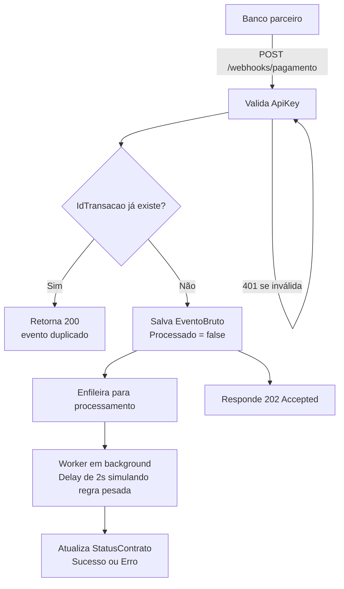

# Sabemi · Webhook de Pagamentos

Serviço que recebe notificações de pagamento (webhooks) de um banco parceiro,
garante que cada transação seja processada **uma única vez** (idempotência),
persiste o histórico bruto dos eventos e expõe um painel administrativo com
o status consolidado de cada contrato.

## Sumário

- [Arquitetura](#arquitetura)
- [Fluxo do webhook](#fluxo-do-webhook)
- [Stack tecnológica](#stack-tecnológica)
- [Estrutura de pastas](#estrutura-de-pastas)
- [Como rodar](#como-rodar)
- [Testando o webhook](#testando-o-webhook)
- [Testes automatizados](#testes-automatizados)
- [Decisões técnicas e trade-offs](#decisões-técnicas-e-trade-offs)
- [O que eu faria com mais tempo](#o-que-eu-faria-com-mais-tempo)

---

## Arquitetura

O backend segue uma **arquitetura em camadas** (Clean Architecture
simplificada), com as dependências sempre apontando para dentro:

```
Sabemi.Webhooks.Api            → Controllers, filtros de segurança, workers, Program.cs
Sabemi.Webhooks.Application    → Casos de uso, DTOs, interfaces (contratos)
Sabemi.Webhooks.Domain         → Entidades e regras de negócio puras (sem dependências externas)
Sabemi.Webhooks.Infrastructure → EF Core, repositórios concretos, acesso ao SQL Server
```

### Onde SOLID foi aplicado

| Princípio | Onde aparece no código |
|---|---|
| **S**ingle Responsibility | `PagamentosController` só orquestra HTTP; toda a regra de negócio fica em `PagamentoWebhookService`. `EventoBruto` e `StatusContrato` só conhecem suas próprias regras de estado. |
| **O**pen/Closed | Novas regras de validação ou novos tipos de notificação podem ser adicionados implementando novas interfaces (`IPagamentoWebhookService`) sem alterar o `Controller`. |
| **L**iskov Substitution | Qualquer implementação de `IEventoBrutoRepository`/`IStatusContratoRepository` (EF Core hoje, poderia ser Dapper ou outro ORM amanhã) pode substituir a atual sem quebrar a `Application`. |
| **I**nterface Segregation | Interfaces pequenas e focadas: `IEventoProcessingQueue` só lida com fila, `IPagamentoConsultaService` só lida com leitura — nenhum consumidor é forçado a depender de métodos que não usa. |
| **D**ependency Inversion | A `Application` depende apenas de abstrações (`IEventoBrutoRepository`, `IEventoProcessingQueue`). A implementação concreta (EF Core, SQL Server) fica isolada na `Infrastructure` e é injetada via DI no `Program.cs`. |

Um exemplo concreto de DIP na prática: a `Application` **não conhece**
`Microsoft.Data.SqlClient`. Quando o banco rejeita uma transação duplicada
(constraint `UNIQUE`), a `Infrastructure` captura o `SqlException` e lança uma
exceção de domínio própria (`TransacaoDuplicadaException`), que a
`Application` trata sem nenhum acoplamento a detalhes do SQL Server.

## Fluxo do webhook



A resposta ao banco (202 Accepted) acontece **antes** do processamento
pesado terminar — o worker consome a fila em memória (`Channel<T>`) de forma
assíncrona, sem bloquear o endpoint.

## Stack tecnológica

**Backend**
- .NET 8 / ASP.NET Core Web API
- Entity Framework Core 8 (Code First + Migrations)
- SQL Server 2025 (Developer Edition)
- `System.Threading.Channels` para a fila de processamento em background
- xUnit + Moq + FluentAssertions para testes

**Frontend**
- React 19 + Vite
- Axios para consumo da API

## Estrutura de pastas

```
Sabemi.Webhooks/
├── src/
│   ├── Sabemi.Webhooks.Api/              # Controllers, filtros, workers, Program.cs
│   ├── Sabemi.Webhooks.Application/      # DTOs, interfaces, serviços de aplicação
│   ├── Sabemi.Webhooks.Domain/           # Entidades e exceções de domínio
│   └── Sabemi.Webhooks.Infrastructure/   # DbContext, repositórios, EF Configurations
├── tests/
│   ├── Sabemi.Webhooks.UnitTests/
│   └── Sabemi.Webhooks.IntegrationTests/
├── frontend/                             # Dashboard em React + Vite
├── docker-compose.yml                    # SQL Server (alternativa ao SQL Server nativo)
└── Sabemi.Webhooks.sln
```

## Como rodar

### Pré-requisitos

- [.NET 8 SDK](https://dotnet.microsoft.com/download)
- [Node.js 18+](https://nodejs.org)
- SQL Server (via `docker compose up -d`, **ou** uma instância local/instalada)

### 1. Banco de dados

Se for usar Docker:

```bash
docker compose up -d
```

Se for usar uma instância local do SQL Server, ajuste a connection string em
`src/Sabemi.Webhooks.Api/appsettings.json` para apontar para sua instância.

### 2. Aplicar as migrations

```bash
dotnet ef database update --project src/Sabemi.Webhooks.Infrastructure --startup-project src/Sabemi.Webhooks.Api
```

### 3. Rodar a API

```bash
dotnet run --project src/Sabemi.Webhooks.Api
```

A API sobe por padrão em `http://localhost:5065` (HTTP) e
`https://localhost:7059` (HTTPS), com Swagger disponível em `/swagger`.

### 4. Rodar o frontend

```bash
cd frontend
npm install
npm run dev
```

Acesse `http://localhost:5173`. A URL da API é configurada via
`frontend/.env` (`VITE_API_URL`).

## Testando o webhook

### Via curl

```bash
curl -X POST http://localhost:5065/webhooks/pagamento \
  -H "Content-Type: application/json" \
  -H "X-Api-Key: sabemi-webhook-secret-key-2026" \
  -d '{
    "idTransacao": "TXN-001",
    "idContrato": "CONTR-123",
    "valor": 1500.50,
    "dataPagamento": "2026-08-20T10:00:00",
    "status": "Sucesso"
  }'
```

Enviando a mesma requisição novamente (mesmo `idTransacao`), a API responde
com `duplicado: true` e não cria um novo registro — validando a idempotência
exigida no desafio.

Um arquivo `requests.http` (compatível com a extensão REST Client do VS Code
ou com o Insomnia/Postman) está incluído na raiz do repositório com esses e
outros exemplos prontos.

### Consultando o resultado

```bash
curl http://localhost:5065/pagamentos
curl http://localhost:5065/contratos/CONTR-123/status
```

## Testes automatizados

```bash
dotnet test tests/Sabemi.Webhooks.UnitTests
```

Cobertura atual:
- Idempotência do `PagamentoWebhookService` (evento novo vs. duplicado)
- Condição de corrida (violação de constraint única tratada como duplicidade)
- `ApiKeyAuthFilter` (sem header, chave inválida, chave válida)
- Regras de domínio das entidades (`AtualizarStatus`, `MarcarComoProcessado`)

## Decisões técnicas e trade-offs

- **Idempotência em duas camadas**: a checagem `ExisteTransacaoAsync` evita
  a maioria dos reprocessamentos de forma barata, mas a garantia real vem do
  índice `UNIQUE` no banco — protege contra condição de corrida quando dois
  webhooks quase simultâneos chegam com o mesmo `idTransacao`.
- **Fila em memória (`Channel<T>`) em vez de uma fila externa** (RabbitMQ,
  Azure Service Bus): suficiente para o escopo do teste e evita
  infraestrutura extra, mas significa que eventos enfileirados e não
  processados **se perdem se a aplicação reiniciar**. Documentado aqui como
  limitação consciente.
- **ApiKey estática no header** em vez de assinatura HMAC do payload: mais
  simples de implementar e testar, mas uma implementação real de produção
  deveria validar a assinatura do corpo da requisição para evitar replay de
  payloads alterados.
- **Log bruto separado do status consolidado**: `EventoBruto` funciona como
  trilha de auditoria imutável (todo evento recebido é registrado, mesmo que
  falhe depois), enquanto `StatusContrato` reflete apenas o estado mais
  recente — essa separação evita perder histórico ao fazer upsert do status.

## O que eu faria com mais tempo

- Teste de integração ponta a ponta com `WebApplicationFactory` (fluxo
  completo: POST duplicado → banco real de teste → verificação do resultado).
- Assinatura HMAC real do payload em vez de ApiKey estática.
- Fila durável (RabbitMQ ou Azure Service Bus) com retry/backoff automático
  em caso de falha no processamento.
- Paginação "infinita" e ordenação configurável no dashboard.
- Autenticação real no dashboard (hoje os endpoints de consulta são
  públicos, adequados apenas para ambiente de desenvolvimento).